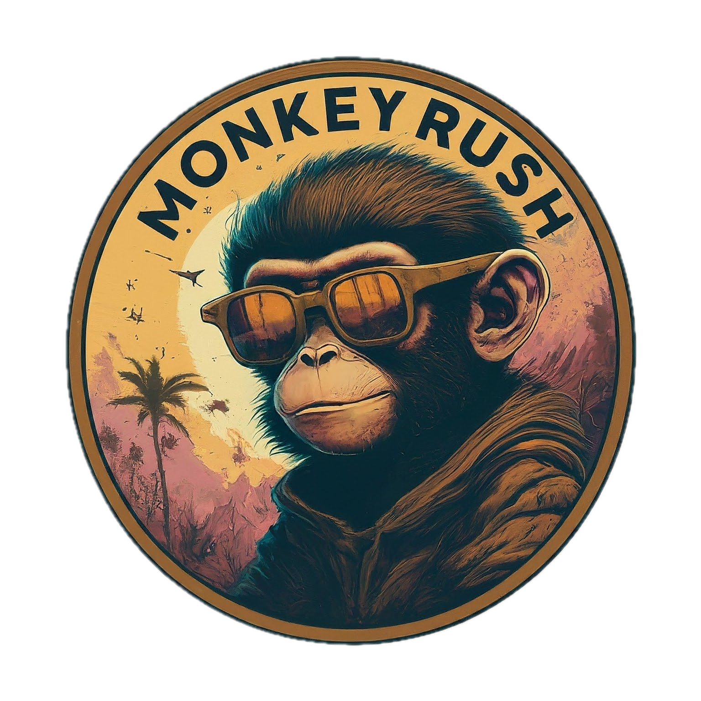

<picture>
  <source media="(prefers-color-scheme: dark)" srcset="./logos/MonkeyRush.png">
  
</picture>

    

      Imports "LongPhrase" and "Maximum Real Feel Temperature" stats from Accuweather to Home Assistant
    

